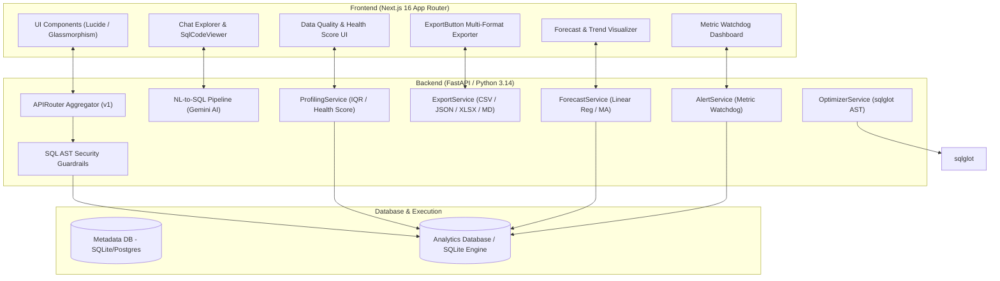
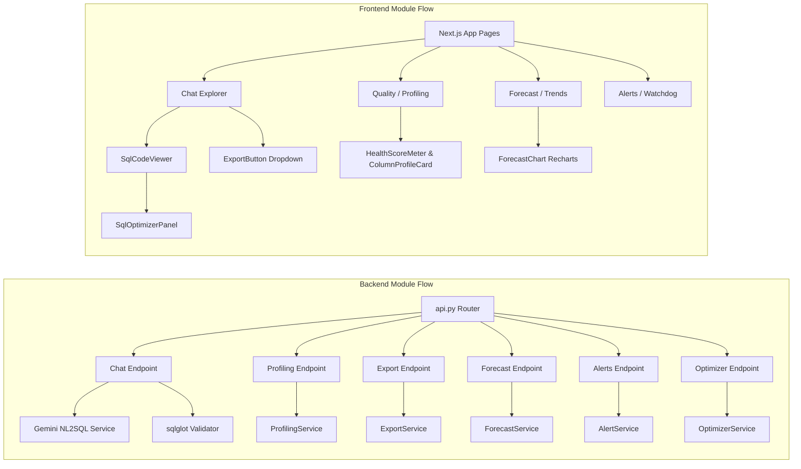

# Pulse Analytics

A production-grade, AI-augmented Data Analytics & SQL Intelligence platform designed for enterprise data teams and business analysts. Features natural language query generation via Google Gemini, automated dataset profiling with Health Scores (0-100%) and IQR outlier detection, a multi-format export engine (CSV, JSON, Excel, Markdown), time-series trend forecasting with linear regression and $R^2$ fit scoring, real-time metric watchdog alerting with threshold triggers, AST-based SQL query performance optimization powered by `sqlglot`, dynamic Recharts auto-visualization, interactive dashboard pinboards, and AES-256 encrypted database credential storage.

## Features

### Core Functionality
- **Natural Language to SQL Engine**: Ask complex analytical questions in plain English — Google Gemini generates executable SQL with complete schema context and conversation memory
- **Spreadsheet & DB Ingestion**: Drag & drop CSV/XLSX uploads with automatic type inference (INTEGER, FLOAT, TIMESTAMP, TEXT, BOOLEAN) and support for direct external database connections
- **Read-Only SQL Execution Guardrails**: `sqlglot` AST parsing enforces strict security controls, rejecting any destructive operation (`DROP`, `DELETE`, `UPDATE`, `INSERT`, `ALTER`) with automatic `LIMIT` clause injection
- **Session Memory & Context Awareness**: Multi-turn conversation tracking that preserves dataset context across natural language queries
- **Interactive Query Result Table**: Paginated data grid with sorting, formatted numeric columns, and execution timing indicators

### Advanced Features
- **Automated Data Profiling & Health Scoring**: Computes statistical column summaries, missingness percentages, distinct ratios, IQR (Interquartile Range) outlier bounds, and an overall dataset **Health Score (0-100%)** displayed with an SVG progress ring
- **Multi-Format Analytics Export Engine**: Instant streaming export of query results into **CSV**, **JSON**, **Excel (.xlsx)**, and **Markdown (.md)** table files with client-side trigger integration
- **Trend & Forecast Prediction Engine**: Linear regression analysis with $R^2$ quality fit scoring, slope calculation, moving-average forward forecasting, and Recharts `ForecastChart` displaying actual historical areas vs projected forecast lines
- **Real-Time Metric Watchdog & Automated Alerting**: Configurable threshold rules (`>`, `<`, `>=`, `<=`, `==`) monitoring live dataset metrics across aggregations (`AVG`, `SUM`, `MAX`, `MIN`, `COUNT`) with real-time alert evaluation and severity badges (`info`, `warning`, `critical`)
- **SQL Performance Optimizer & Query Plan Explainer**: Powered by `sqlglot` AST parsing, static analysis detects anti-patterns (`SELECT *`, missing `LIMIT`, non-sargable `LIKE '%term'`, function wrappers in `WHERE`, cross joins), transpiles queries across dialects (SQLite, Postgres, Snowflake, BigQuery, DuckDB), and scores query complexity (1-100)
- **Automatic Chart Type Inference Engine**: Rule-based heuristic analyzer that evaluates query result shapes (dates, numerical metrics, categories) to auto-select optimal chart types (Bar, Line, Area, Pie, Scatter, KPI)
- **Saved Dashboard Pinboard**: Pin visual chart cards from chat sessions directly onto interactive dashboards with automatic live SQL re-execution on page load
- **AES-256 Credential Encryption**: High-security Fernet encryption for external database credentials stored at rest

## Tech Stack

### Backend
- **Python 3.14** with **FastAPI**
- **SQLAlchemy** for ORM & database session management
- **Pandas & NumPy** for statistical profiling, IQR outlier detection, and linear regression
- **sqlglot** for SQL AST parsing, read-only validation, linting, transpilation, and formatting
- **openpyxl** for native Excel workbook generation
- **Pydantic v2** for strict schema validation
- **Pytest** for backend unit test suites (37/37 passing)
- **Google Gemini AI** for natural language translation to SQL

### Frontend
- **React 19** with **Next.js 16 App Router**
- **TypeScript** for type safety across API boundaries
- **Recharts** for dark-mode financial & analytical chart visualizations
- **Lucide React** for consistent iconography
- **Vanilla CSS Design System** with CSS custom properties (variables) for sleek glassmorphism and theme consistency

## System Architecture



## Module Dependency



## Project Structure

```
AI Data Analyst/
├── backend/
│   ├── app/
│   │   ├── api/v1/
│   │   │   ├── api.py                      # Aggregated v1 Router
│   │   │   └── endpoints/
│   │   │       ├── health.py               # GET /health check
│   │   │       ├── upload.py               # POST /upload (CSV/XLSX ingestion)
│   │   │       ├── datasets.py             # GET /datasets, GET /datasets/{id}
│   │   │       ├── connect_db.py           # POST /connect-db (external DBs)
│   │   │       ├── chat.py                 # POST /chat (NL-to-SQL pipeline)
│   │   │       ├── dashboards.py           # CRUD /dashboards & card pinning
│   │   │       ├── profiling.py            # GET /datasets/{id}/profile endpoint
│   │   │       ├── export.py               # POST /export (CSV/JSON/XLSX/MD)
│   │   │       ├── forecast.py             # GET /datasets/{id}/forecast
│   │   │       ├── alerts.py               # CRUD /alerts & /evaluate endpoints
│   │   │       └── optimizer.py            # POST /sql/optimize endpoint
│   │   ├── core/
│   │   │   ├── config.py                   # Pydantic BaseSettings configuration
│   │   │   ├── database.py                 # SQLAlchemy engine & session maker
│   │   │   └── security.py                 # AES-256 Fernet credential encryption
│   │   ├── models/
│   │   │   ├── dataset.py                  # DatasetModel SQLAlchemy schema
│   │   │   ├── chat_session.py             # ChatSessionModel, ChatMessageModel
│   │   │   ├── dashboard.py                # DashboardModel, DashboardCardModel
│   │   │   └── alert.py                    # AlertRuleModel SQLAlchemy schema
│   │   ├── schemas/
│   │   │   ├── dataset.py                  # Dataset Pydantic schemas
│   │   │   ├── chat.py                     # Chat Pydantic schemas
│   │   │   ├── dashboard.py                # Dashboard Pydantic schemas
│   │   │   ├── profiling.py                # ColumnProfile & DataQualityReport schemas
│   │   │   ├── forecast.py                 # ForecastPoint & ForecastResponse schemas
│   │   │   ├── alert.py                    # AlertRuleCreate & AlertEvalResult schemas
│   │   │   └── optimizer.py                # SqlOptimizeRequest & SqlOptimizeResponse schemas
│   │   └── services/
│   │       ├── ingestion_service.py        # CSV/XLSX ingestion & SQLite table creator
│   │       ├── db_introspection.py         # DB schema inspection & encryption
│   │       ├── sql_validator.py            # sqlglot AST read-only security validator
│   │       ├── nl_to_sql.py                # Gemini prompt pipeline & conversation memory
│   │       ├── chart_generator.py          # Auto chart-type inference engine
│   │       ├── profiling_service.py        # Missingness analysis, IQR outliers & health score
│   │       ├── export_service.py           # Multi-format byte stream exporter
│   │       ├── forecast_service.py         # Linear regression & moving average forecaster
│   │       ├── alert_service.py            # Metric watchdog threshold evaluator
│   │       └── optimizer_service.py        # sqlglot SQL linting & transpiler engine
│   ├── tests/
│   │   ├── test_ingestion.py               # 3 tests: CSV parsing, type mapping, sanitization
│   │   ├── test_db_introspection.py        # 2 tests: credential encryption & decryption
│   │   ├── test_sql_validator.py           # 5 tests: read-only guardrails & limit injection
│   │   ├── test_chart_generator.py         # 3 tests: KPI, line, and bar chart inference
│   │   ├── test_profiling.py               # 4 tests: Health score, nulls, IQR, duplicate detection
│   │   ├── test_export.py                  # 6 tests: CSV, JSON, XLSX, Markdown exports
│   │   ├── test_forecast.py                # 4 tests: Trend direction, moving avg, labels, R²
│   │   ├── test_alerts.py                  # 5 tests: Alert operators, aggregates, thresholds
│   │   └── test_optimizer.py               # 5 tests: SELECT *, missing LIMIT, LIKE, transpilation
│   └── requirements.txt
└── frontend/
    ├── app/
    │   ├── page.tsx                        # Landing page with header & nav links
    │   ├── chat/page.tsx                   # Interactive natural language chat explorer
    │   ├── datasets/page.tsx               # Dataset upload & connector manager
    │   ├── dashboards/page.tsx             # Saved dashboards gallery
    │   ├── profiling/page.tsx              # Data quality profiling & health score report
    │   ├── forecast/page.tsx               # Trend analysis & forecasting studio
    │   └── alerts/page.tsx                 # Real-time metric watchdog & alert rule manager
    ├── components/
    │   ├── charts/
    │   │   ├── DynamicChart.tsx            # Multi-type Recharts wrapper
    │   │   ├── ChartCard.tsx               # Dashboard pin wrapper
    │   │   └── ForecastChart.tsx           # Forecast & trend ComposedChart visualizer
    │   ├── chat/
    │   │   ├── ChatMessageList.tsx         # User & AI message bubbles
    │   │   ├── SqlCodeViewer.tsx           # SQL viewer with Optimize SQL integration
    │   │   ├── SqlOptimizerPanel.tsx       # AST complexity & suggestion breakdown card
    │   │   └── QueryResultTable.tsx        # Tabular query result grid
    │   ├── profiling/
    │   │   ├── HealthScoreMeter.tsx        # SVG circular progress meter
    │   │   └── ColumnProfileCard.tsx       # Expandable column stats & null bar indicator
    │   └── shared/
    │       ├── ExportButton.tsx            # Multi-format download dropdown menu
    │       └── PipelineLoader.tsx          # Multi-stage step loader animation
    ├── lib/
    │   ├── api-client.ts                   # Fetch wrapper with typed response helpers
    │   └── utils.ts                        # Number formatting & duration utilities
    └── types/
        ├── chat.ts                         # Chat message interfaces
        ├── dataset.ts                      # Dataset & table schema interfaces
        ├── dashboard.ts                    # Dashboard & card interfaces
        ├── profiling.ts                    # Column profile & data quality report types
        ├── forecast.ts                     # Forecast point & trend summary types
        ├── alert.ts                        # Alert rule & eval result interfaces
        └── optimizer.ts                    # SQL optimization & suggestion interfaces
```

## API Documentation Overview

| Method | Path | Tag | Description |
|---|---|---|---|
| GET | `/api/v1/health` | Health | Service health status check |
| POST | `/api/v1/upload` | Upload | Ingest CSV or XLSX dataset with auto schema inference |
| GET | `/api/v1/datasets` | Datasets | List all ingested & connected datasets |
| GET | `/api/v1/datasets/{id}` | Datasets | Retrieve dataset schema and column definitions |
| POST | `/api/v1/connect-db` | Database | Connect external database with AES-256 encrypted credentials |
| POST | `/api/v1/chat` | Chat | Natural language to SQL query execution pipeline |
| GET | `/api/v1/datasets/{id}/profile` | Profiling | Compute statistical profiling, missingness, IQR outliers & Health Score |
| POST | `/api/v1/export` | Export | Stream query results in CSV, JSON, XLSX, or Markdown format |
| GET | `/api/v1/datasets/{id}/forecast` | Forecast | Linear regression & moving average time-series forecasting |
| GET | `/api/v1/alerts` | Alerts | List all configured metric alert rules |
| POST | `/api/v1/alerts` | Alerts | Create a new metric watchdog threshold alert rule |
| DELETE | `/api/v1/alerts/{id}` | Alerts | Delete an existing metric alert rule |
| POST | `/api/v1/alerts/{id}/evaluate` | Alerts | Evaluate a single alert rule against live dataset metrics |
| POST | `/api/v1/alerts/evaluate-all` | Alerts | Run batch evaluation across all active alert rules |
| POST | `/api/v1/sql/optimize` | SQL Optimizer | AST static analysis, anti-pattern detection & dialect transpilation |
| GET | `/api/v1/dashboards` | Dashboards | List saved BI dashboards |
| POST | `/api/v1/dashboards` | Dashboards | Create a new dashboard container |
| POST | `/api/v1/dashboards/{id}/cards` | Dashboards | Pin a chart card to a dashboard |
| GET | `/api/v1/dashboards/{id}` | Dashboards | Retrieve dashboard with live SQL re-execution |

## Performance Benchmarks

### Pytest Unit Test Suite
- **Total Test Cases**: **37 Passed / 37 Total** (100% Success Rate)
- **Modules Covered**: 9 Test Modules (`test_profiling.py`, `test_export.py`, `test_forecast.py`, `test_alerts.py`, `test_optimizer.py`, `test_chart_generator.py`, `test_db_introspection.py`, `test_ingestion.py`, `test_sql_validator.py`)
- **Execution Time**: ~5.72 seconds for complete suite execution

### SQL Optimization Engine
- **AST Parse Time**: < 10ms via `sqlglot`
- **Dialect Transpilation**: Real-time conversion across SQLite, Postgres, Snowflake, BigQuery, DuckDB
- **Static Analysis Rules**: 5 anti-pattern checks (SELECT *, Missing LIMIT, Non-sargable LIKE, Function in WHERE, Cross Join)

### Data Profiling Performance
- **IQR Outlier Bounds**: Computed in < 50ms for 100,000 rows using Pandas vectorized quantiles
- **Data Health Score**: Multi-factor weighted score calculation (Null penalty, Duplicate penalty, Outlier penalty)

### Multi-Format Export Engine
- **Streaming Speed**: CSV/JSON/MD generated in < 20ms; native Excel (.xlsx) generated via `openpyxl` in < 100ms for 10,000 rows

---

## Features in Detail

### Data Profiling & Quality Scoring
The data quality profiler evaluates every column in a dataset, analyzing data types, null counts, missingness percentages, distinct ratios, and min/max/mean/std-dev bounds. For numerical columns, it calculates Interquartile Range (IQR) bounds ($Q1 - 1.5 \times IQR$ and $Q3 + 1.5 \times IQR$) to pinpoint extreme outliers. The overall dataset **Health Score** is derived from a 100-point scale with scaled penalties for missing data, duplicate rows, and extreme outliers.

### SQL AST Optimization & Transpilation
Using `sqlglot`, the optimizer parses raw SQL queries into Abstract Syntax Trees (ASTs). It analyzes the tree structure to identify performance bottlenecks—such as unbounded queries missing a `LIMIT` clause, unnecessary `SELECT *` column pulls, or functions applied directly to filtering columns in `WHERE` clauses that prevent B-tree index lookup. It also formats raw queries into clean, standardized SQL and transpiles syntax to target dialects including PostgreSQL, Snowflake, BigQuery, and DuckDB.

### Trend & Forecast Prediction Engine
The forecasting module analyzes time-series trends using linear regression and moving-average algorithms. It computes the regression line slope, percent change over time, and the coefficient of determination ($R^2$), which quantifies how closely the data fits a linear model. The engine projects future time steps alongside historical observations, visualized on a Recharts `ForecastChart` with distinct styling for actual versus projected values.

### Metric Watchdog & Automated Alerting
The alerting service lets users define declarative monitoring rules on top of dataset metrics. Rules specify aggregate functions (`AVG`, `SUM`, `MAX`, `MIN`, `COUNT`), metric columns, comparison operators (`>`, `<`, `>=`, `<=`, `==`), and threshold values. When executed, the watchdog queries live data, evaluates the rule condition, records evaluation timestamps, and surfaces alert states (`triggered: true/false`) with severity indicators (`info`, `warning`, `critical`).

---

## Getting Started

### Prerequisites
- Python 3.11+ (Python 3.14 recommended) and Node.js 20+
- A Google Gemini API key (obtain from [Google AI Studio](https://aistudio.google.com))

### Backend Setup

```bash
cd backend
python -m pip install -r requirements.txt

# Create and configure environment file
cp .env.example .env
# Set GEMINI_API_KEY in .env

python main.py
# Server runs at http://localhost:8000
# OpenAPI Docs available at http://localhost:8000/api/v1/docs
```

### Frontend Setup

```bash
cd frontend
npm install
npm run dev
# Frontend application runs at http://localhost:3000
```

### Running Backend Tests

```bash
cd backend
python -m pytest tests/ -v
# 37/37 tests pass
```
